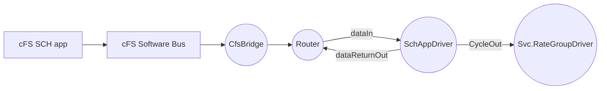

# FPrimeCfs::SchAppDriver

Rate group driver triggered by cFS scheduler (SCH) messages.

## Introduction

`FPrimeCfs::SchAppDriver` implements the `Drv.Tick` interface, driving an F Prime
rate group tree from messages sent by the cFS scheduler (SCH) application.
Scheduler messages arrive over the cFS software bus, are deframed by the
`FPrimeCfs::CfsBridge`, and are routed to this component's `dataIn` port by the
router. Each received message produces one tick on `CycleOut`, which is
intended to be connected to `Svc.RateGroupDriver`.

Unlike `Svc::PollingTimer`, this component requires no polling from the main
program loop: the system tick rate is governed entirely by the cFS scheduler.
Stopping is implicit — when the application exits the cFS run loop, no further
messages are dispatched and no ticks are produced.

## Requirements

| Name | Description | Rationale | Validation |
|---|---|---|---|
| REQ-SchAppDriver-001 | The component shall receive scheduler messages as deframed buffers with APID context on an F Prime input port (`Svc.ComDataWithContext`) fed from the CfsBridge/router path. | Scheduler messages arrive via the cFS software bus and are routed through the F Prime deframing path. | Unit test |
| REQ-SchAppDriver-002 | Upon receipt of a scheduler message, the component shall emit exactly one tick on `CycleOut` (with an `Os::RawTime` timestamp) to drive `Svc::RateGroupDriver`. | The cFS scheduler governs the fundamental tick rate of the F Prime rate group tree. | Unit test |
| REQ-SchAppDriver-003 | The component shall return ownership of every received buffer via `dataReturnOut` after processing. | Buffer ownership must be returned to the sender to complete the data transfer contract. | Unit test |

## Design

The component is passive: the tick is emitted in the caller's thread within the
`dataIn` handler. `Svc::RateGroupDriver` is also passive and dispatches to
(active) rate groups, which cross to their own threads, so the work performed
in the caller's context is minimal.

## Configuration

No configuration is required. The subscription to the scheduler message ID on
the software bus is performed by the application (via `CfsBridge::subscribe`)
and routing of the scheduler APID to this component is a topology concern.
