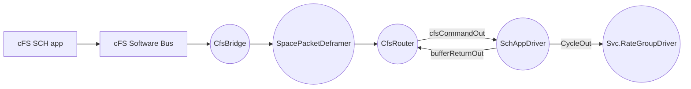

# FPrimeCfs::SchAppDriver

Rate group driver triggered by cFS scheduler (SCH) messages.

## Introduction

`FPrimeCfs::SchAppDriver` implements the `Drv.Tick` interface, driving an F Prime
rate group tree from messages sent by the cFS scheduler (SCH) application.
Scheduler messages are cFS command messages: they arrive over the cFS software
bus, are emitted whole by the `FPrimeCfs::CfsBridge`, deframed by the space
packet deframer, and routed by the `FPrimeCfs::CfsRouter` — with the scheduler
APID configured on the cFS command route — to this component's `cfsCommandIn`
port. Each received message carrying the expected function code produces one
tick on `CycleOut`, which is intended to be connected to `Svc.RateGroupDriver`.
Messages with any other function code are rejected with a warning event and
produce no tick.

Unlike `Svc::PollingTimer`, this component requires no polling from the main
program loop: the system tick rate is governed entirely by the cFS scheduler.
Stopping is implicit — when the application exits the cFS run loop, no further
messages are dispatched and no ticks are produced.

## Requirements

| Name | Description | Rationale | Validation |
|---|---|---|---|
| REQ-SchAppDriver-001 | The component shall receive scheduler messages as cFS commands (function code + payload) on an F Prime input port (`FPrimeCfs.CfsCommand`) fed from the CfsRouter's cFS command route. | Scheduler messages are cFS command messages arriving via the software bus and routed through the CfsBridge/deframer/CfsRouter path. | Unit test |
| REQ-SchAppDriver-002 | Upon receipt of a scheduler message, the component shall emit exactly one tick on `CycleOut` (with an `Os::RawTime` timestamp) to drive `Svc::RateGroupDriver`. | The cFS scheduler governs the fundamental tick rate of the F Prime rate group tree. | Unit test |
| REQ-SchAppDriver-003 | The component shall return ownership of every received buffer via `bufferReturnOut` after processing. | The CfsRouter's cFS routes transfer buffer ownership to the receiver, which must return it via the router's `bufferReturnIn` port. | Unit test |
| REQ-SchAppDriver-004 | The component shall validate the function code of each received message against the configured expected value; messages with an unexpected function code shall produce a warning event and no tick. | Only the expected scheduler message should drive the rate group tree; other messages indicate a routing or configuration error. | Unit test |

## Design

The component is passive: the tick is emitted in the caller's thread within the
`cfsCommandIn` handler. `Svc::RateGroupDriver` is also passive and dispatches to
(active) rate groups, which cross to their own threads, so the work performed
in the caller's context is minimal. The function code of each message is
validated against the expected value set via `configure()` (default 0, the
function code of cFS scheduler wakeup messages); the payload is not
interpreted.

## Configuration

The scheduler APID must be present in the project's `ComCfg.Apid` enumeration
and configured on a `CFS_COMMAND` route in the CfsRouter's routing table
(`CFS_ROUTER_ROUTE_TABLE` in `CfsRouterCfg.fpp`), with the route's port index
connected to this component's `cfsCommandIn`. The subscription to the scheduler
message ID on the software bus is performed by the application (via
`CfsBridge::subscribe`).

If the scheduler messages carry a function code other than the default of 0,
call `configure()` with the expected function code before the topology starts.
