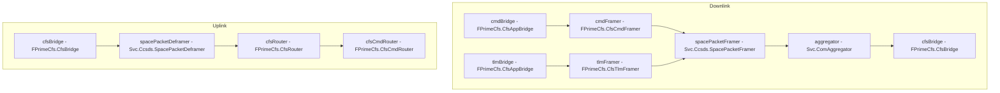

# ComCfs Subtopology

The ComCfs subtopology boxes the full communications stack of an F Prime application hosted as a cFS app. It is
modeled after the F Prime `ComCcsds.SpacePacketFraming` subtopology, extended with the cFS secondary framers, the
app bridges above them, the cFS-aware routers on the uplink chain, and the `FPrimeCfs.CfsBridge` at the bottom in
place of a communications driver.



## Downlink

Two `FPrimeCfs.CfsAppBridge` instances feed the two cFS secondary framers:

- `cmdBridge` accepts outgoing cFS commands (function code + payload) on the exported `cfsCommandIn` port and feeds
  the `FPrimeCfs.CfsCmdFramer`, which prepends the 2-byte cFS command secondary header.
- `tlmBridge` accepts outgoing F Prime com buffers (telemetry, events, packetized telemetry) on the exported `comIn`
  port array and feeds the `FPrimeCfs.CfsTlmFramer`, which prepends the 6-byte cFS telemetry secondary header. The
  telemetry framer's `cfsTimeConvert` port is exported as `cfsTimeConvertOut` and should be connected to a
  `FPrimeCfs.CfsSystemTime` instance (e.g. `CfsCore.cfsTime`).

Both secondary framers feed the `Svc.Ccsds.SpacePacketFramer`, which completes the CCSDS space packet and passes it
through the `Svc.ComAggregator` to the `FPrimeCfs.CfsBridge`, which publishes it on the cFS software bus.

Only the command framer's `dataReturnIn` is connected to the space packet framer's return path: both secondary
framers allocate from and deallocate to the same shared buffer pool (`commsBufferManager`), so either framer can
return a buffer allocated by the other. Projects overriding the buffer allocation must preserve this shared-pool
invariant.

`cmdBridge` is configured with the command APID `ComCfs::BridgeConfig::commandApid` defined in
`ComCfsConfig/ComCfsSubtopologyConfig.cpp`. Projects override the configuration module
(`register_fprime_config` `CONFIGURATION_OVERRIDES`) to supply the command message ID APID of the destination cFS
application, as well as queue sizes, priorities, and buffer pool sizes in `ComCfsConfig.fpp`.

## Uplink

The `FPrimeCfs.CfsBridge` subscribes to configured message IDs on the cFS software bus and forwards complete space
packets to the `Svc.Ccsds.SpacePacketDeframer`. Deframed packets are routed by APID by the `FPrimeCfs.CfsRouter`;
APIDs without a configured route (including this application's own command message ID by default) flow to the
`FPrimeCfs.CfsCmdRouter`, which routes by cFS command function code ahead of commanding. Both routers' route tables
are statically configured in their respective configuration modules (`CfsRouterConfig`, `CfsCmdRouterConfig`).

## CfsBridge configuration and scheduling

The `cfsBridge` instance is configured during the `configComponents` phase: it creates its software bus pipe with
depth `ComCfsConfig::Bridge::pipeDepth` and subscribes to the uplink command APID
`ComCfs::BridgeConfig::uplinkApid` (defined in `ComCfsConfig/ComCfsSubtopologyConfig.cpp`; projects override the
configuration module to supply this application's command message ID and any additional subscriptions).

The bridge is a queued component: deployments must drive the exported `cfsBridgeSchedIn` port from a rate group
(each tick drains the bridge's message queue and polls the software bus once) or call `cfsBridge.process()` from a
dedicated loop. The bridge's `bufferAllocate`/`bufferDeallocate` ports are connected to `commsBufferManager`, so
each received software bus message is copied into an allocated buffer before entering the uplink chain; downstream
consumers (including deferred-return routes such as file uplink) may therefore hold buffers past the bridge's
polling cycle. When the bridge is configured with `paused = true`, the exported `cfsBridgeComStatusIn` port must
be connected to release uplink flow control.

## Exported ports

| Port | Direction | Description |
|---|---|---|
| `cfsCommandIn` | in | Outgoing cFS commands (function code + payload) into the command app bridge |
| `cfsCommandBufferReturnOut` | out | Returns ownership of buffers received on `cfsCommandIn` |
| `comIn` | in (array) | Outgoing F Prime com buffers into the telemetry app bridge |
| `cfsTimeConvertOut` | out | F Prime to cFS time conversion (connect to `FPrimeCfs.CfsSystemTime`) |
| `commandOut` | out (array) | Routed F Prime command packets |
| `cmdResponseIn` | in | Command responses back into the APID router |
| `cfsCommandOut` | out (array) | Routed cFS commands (function code + payload) |
| `cfsTelemetryOut` | out (array) | Routed cFS telemetry (time + payload) |
| `bufferReturnIn` | in | Ownership return for `cfsCommandOut` / `cfsTelemetryOut` buffers |
| `fileUplinkOut` | out | Uplinked file packets |
| `fileUplinkReturnIn` | in | Ownership return from the file handling stack |
| `cmdRouterComOut` | out (array) | Function-code-routed messages as `Fw::ComBuffer`s |
| `cmdRouterCmdResponseIn` | in | Command responses back into the command router |
| `cmdRouterBufferOut` | out (array) | Function-code-routed payloads |
| `cmdRouterUnknownDataOut` | out | Messages with no configured function code route |
| `cmdRouterBufferReturnIn` | in | Ownership return for `cmdRouterBufferOut` / `cmdRouterUnknownDataOut` buffers |
| `aggregatorTimeout` | in | Rate-group driven timeout flushing the aggregator |
| `bufferManagerSchedIn` | in | Rate-group driven buffer manager telemetry |
| `cfsBridgeSchedIn` | in | Rate-group tick driving the CfsBridge queue and software bus poll |
| `cfsBridgeComStatusIn` | in | Releases CfsBridge uplink flow control (required when configured paused) |

## Example usage

```
topology MyApp {
    import ComCfs.Subtopology
    import CfsCore.Subtopology

    connections Scheduler {
        ComCfs.Subtopology.cfsCommandOut[0] -> CfsCore.Subtopology.cfsCommandIn
        CfsCore.Subtopology.schBufferReturnOut -> ComCfs.Subtopology.bufferReturnIn
    }

    connections Commanding {
        ComCfs.Subtopology.cmdRouterComOut[0] -> CfsCore.Subtopology.seqCmdBuff
        CfsCore.Subtopology.seqCmdStatus -> ComCfs.Subtopology.cmdRouterCmdResponseIn
    }

    connections Downlink {
        CfsCore.Subtopology.tlmSendPktSend[0] -> ComCfs.Subtopology.comIn[0]
    }

    connections RateGroups {
        rateGroup1.RateGroupMemberOut[0] -> ComCfs.Subtopology.aggregatorTimeout
        rateGroup1.RateGroupMemberOut[1] -> ComCfs.Subtopology.bufferManagerSchedIn
        rateGroup1.RateGroupMemberOut[2] -> ComCfs.Subtopology.cfsBridgeSchedIn
    }

    connections Time {
        ComCfs.Subtopology.cfsTimeConvertOut -> CfsCore.Subtopology.cfsTimeConvert
    }
}
```
