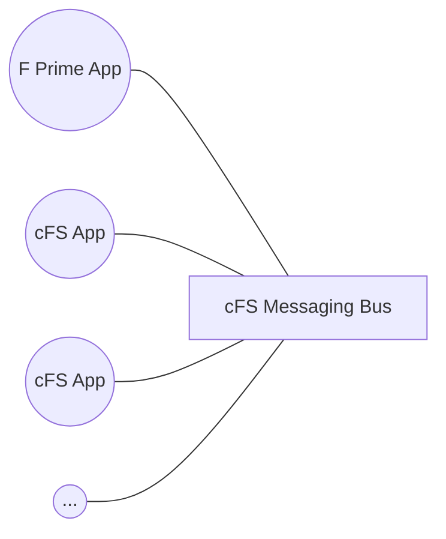
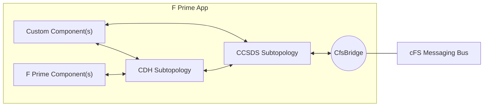

# fprime_cfs

This library supports the use of the F Prime framework as a mechanism for building cFS applications. This library
contains the necessary helper components to expedite the development of cFS applications using the F Prime framework.

> [!WARNING]
> This code is currently a functional prototype. Some adjustments may be required for your specific project.

## Design



The `fprime_cfs` library is designed to allow F Prime implementations of cFS applications that attach to the cFS messaging bus just like any other cFS application.



The reusable components and topologies provided by F Prime can be used to construct the internals of the cFS app.  The CfsBridge component provided by this library bridges F Prime to the cFS bus allowing for the production and consumption of cFS messages.


## Components

| Component    | Purpose                                                         | SDD Link                                             |
|--------------|-----------------------------------------------------------------|------------------------------------------------------|
| CfsBridge    | Expose access to the cFS messaging bus as an F Prime Component. | [CfsBridge](./FPrimeCfs/CfsBridge/docs/sdd.md)       |
| EvsMirror    | Pass-through that mirrors F Prime events to cFS Event Services (EVS). | [EvsMirror](./FPrimeCfs/EvsMirror/docs/sdd.md)  |
| PollingTimer | Rate group timer that is polled by the main program loop.       | [PollingTimer](./FPrimeCfs/PollingTimer/docs/sdd.md) |

## Integration and Usage

In order to use this library, you will need to add fprime and this library as librarues in your cFS `targets.cmake`:

```cmake
list(APPEND MISSION_GLOBAL_APPLIST fprime fprime_cfs ...)
```

This will integrate the library into the cFS build and make the targets available for the F Prime build as well.

## Work To Go

This library still needs to demonstrate how to subscribe to cFS messages that aren't strictly commands (e.g. telemetry) and how to rout these messages.

Unsupported features:
1. Unit-Tests
2. Cross-compilation to other F Prime platforms

